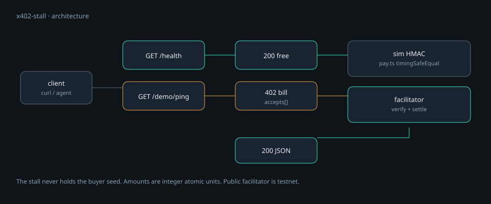

<p align="center">
  
</p>

<h1 align="center">x402-stall</h1>

<p align="center">
  <strong>An HTTP 402 Payment Required stall.</strong><br>
  Agents or scripts pay a small USDC amount, then get JSON. This process does not hold buyer keys.
</p>

<p align="center">
  <a href="README.md"><strong>English</strong></a> ·
  <a href="README.zh-CN.md">中文</a> ·
  <a href="learn/README.md">Learn</a> ·
  <a href="docs/PROJECT-PLAN.md">Plan</a> ·
  <a href="SECURITY.md">Security</a>
</p>

<p align="center">
  
  
  
  
</p>

---

HTTP already had **402 Payment Required**. [x402](https://www.x402.org/) makes that status machine-readable: which stablecoin, which network, who to pay, how much. A **facilitator** verifies and settles so the seller process does not scan the chain with a hot wallet.

This repo is the **cash register**, not the store. Unique data should come from [hlsentry](https://github.com/toolazytoname/hlsentry), [oddsradar](https://github.com/toolazytoname/oddsradar), or [chaintail](https://github.com/toolazytoname/chaintail). Without unique data, do not open an empty shop.

> The public facilitator at `https://x402.org/facilitator` is **testnet** (Base Sepolia, `eip155:84532`). Mainnet typically needs a Coinbase CDP key. This process still never custodies the buyer’s wallet.

## Why this exists

Charging an agent per request is a protocol problem, not a new token. x402-stall speaks the existing 402 negotiation. Tests run against a local **simulated** facilitator (HMAC-SHA256, timing-safe verify) so CI does not need USDC.

## Features

| | |
|---|---|
| **Two modes, one HTTP face** | `sim` for tests; `facilitator` for a public verifier. Clients still see 402 → pay → retry. |
| **No buyer custody** | Users pay *you*. You never ask for their seed. |
| **Integer amounts** | Smallest units as strings (`1000` = 0.001 USDC at 6 decimals). |
| **Constant-time sim verify** | `timingSafeEqual` on HMAC proofs. |
| **Free health** | `GET /health` is 200. The paid demo is `GET /demo/ping`. |

## How it works

<p align="center">
  
</p>

| Path | Auth | Result |
|---|---|---|
| `GET /health` | none | `{"ok": true}` |
| `GET /demo/ping` (no `X-PAYMENT`) | — | **402** with `accepts` / payment requirements |
| `POST /sim/pay` | sim nonce | Returns an HMAC `proof` (local mode only) |
| `GET /demo/ping` + `X-PAYMENT` | proof or facilitator payload | **200** JSON |

## Requirements

- [Node.js](https://nodejs.org/) **≥ 20**
- No wallet for `sim` mode
- For facilitator mode: a receive address (`PAY_TO`) and network access to the facilitator URL

```bash
git clone https://github.com/toolazytoname/x402-stall.git
cd x402-stall
npm install
npm test
```

This package is an app (`private: true`), not something to publish to npm.

## Quick start

**Simulated facilitator (tests / laptop):**

```bash
npx tsx src/cli.ts serve --port 8420
```

In another terminal:

```bash
curl -sS http://127.0.0.1:8420/health
curl -sS -D- http://127.0.0.1:8420/demo/ping    # 402
```

`GET /demo/ping` without a payment header returns a challenge. In sim mode, `POST /sim/pay` with that nonce issues a proof; send it back as `X-PAYMENT`.

**Public facilitator (Base Sepolia, still no buyer keys):**

```bash
PAY_TO=0xYourAddress X402_MODE=facilitator npx tsx src/cli.ts serve --port 8420
```

Optional env:

| Variable | Default | Role |
|---|---|---|
| `X402_MODE` | `sim` unless `PAY_TO` is set | `sim` or `facilitator` |
| `PAY_TO` | empty | Seller receive address |
| `FACILITATOR_URL` | `https://x402.org/facilitator` | Verify + settle |
| `X402_NETWORK` | `eip155:84532` | Base Sepolia |
| `X402_ASSET` | Base Sepolia USDC | ERC-20 address |
| `X402_AMOUNT` | `1000` | Smallest units |
| `X402_SIM_SECRET` | a dev-only string | HMAC key for **sim** only |

Confirm the facilitator is alive before talking about mainnet:

```bash
curl -sS https://x402.org/facilitator/supported
```

## CLI

| Command | Purpose |
|---|---|
| `serve [--host HOST] [--port N]` | Listen (default `127.0.0.1:8420`). |
| `doctor [--config FILE]` | Refuse planted secret field names; print mode. |
| `prove --nonce HEX [--amount N]` | Print a sim HMAC proof (local testing). |

```bash
npx tsx src/cli.ts doctor
npm start    # tsx src/cli.ts serve --port 8420
```

## Tests

```bash
npm test
```

The suite typechecks, refuses a fixture with secret-shaped keys, walks health → 402 → sim pay → JSON, and rejects a bad proof. Hitting `/supported` on the public facilitator is skipped if the network is down.

## Security

Read **[`SECURITY.md`](SECURITY.md)**.

- Do not log full payment signatures beyond verify + idempotent fulfill.
- Rate-limit and cap what one payment unlocks.
- Do not sell data you are not allowed to redistribute.
- Prefer a facilitator so this process never holds a seller hot key. If a key is unavoidable, it must be spend-limited and used for nothing else.
- Sim HMAC secret is an env var, not a wallet.

## Non-goals

- Invent a new payment protocol
- Name the company after x402
- Charge for public data anyone can scrape for free
- Custody user wallets
- Build a settlement contract in this process
- Wire mainnet CDP in v0.1 (that is an account and compliance step, not another protocol)

## Learn

[`learn/`](learn/) is the 402 / facilitator walk-through and a three-step curl exercise. Cover animation: [`learn/assets/cover.mp4`](learn/assets/cover.mp4).

## Related

The stall is empty until one of these produces data worth paying for:

- [hlsentry](https://github.com/toolazytoname/hlsentry)
- [oddsradar](https://github.com/toolazytoname/oddsradar)
- [chaintail](https://github.com/toolazytoname/chaintail)

## License

[MIT](LICENSE) © 2026 toolazytoname
